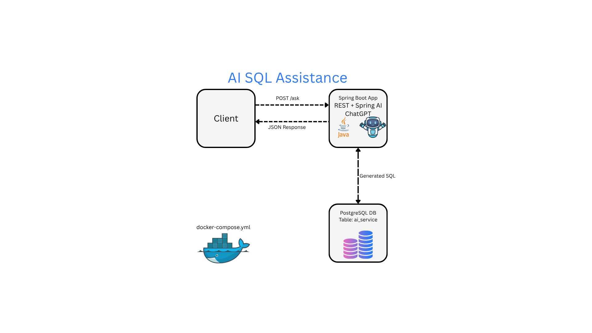

# Spring AI SQL Assistant
  
Ask a question in natural language, and AI will generate and execute a SQL query. The application is connected to PostgreSQL, where the `ai_service` table containing the parameters of 18 AI models (prices, SQL support, providers, etc.) is stored.

## 💡 Tech Stack

- Java 
- Spring Boot 3.4.5
- Spring AI 1.0.0-M8
- PostgreSQL
- OpenAI GPT (gpt-3.5-turbo)
- 🐳 Docker + Docker Compose

## Project Showcase


- [UI walkthrough video](./media_examples/app_video.mp4) _(short demo, downloadable if not previewable)_
- 📂 Example screenshots and results are located in the `media_example/` folder

## ⚙️ Key Engineering Challenges

- **Natural language to SQL translation using LLMs**  
  Integrated Spring AI with OpenAI (GPT-3.5) to translate user questions into SQL queries based on the structure of the `ai_services` table.

- **Safe dynamic SQL execution**  
  Designed a secure way to execute dynamically generated SQL without injection risks, using validation and controlled execution via `JdbcTemplate`.

- **Database bootstrapping with production-ready data**  
  On first startup, the PostgreSQL container automatically initializes the `ai_services` table with 18 real AI model entries via `spring_ai_init.sql`.

- **Dockerized multi-container setup with persistent storage**  
  Used Docker Compose to orchestrate the Spring Boot app and PostgreSQL with named volumes and health checks to ensure reliable startup and data persistence.

- **Flexible, language-agnostic prompting pipeline**  
  The LLM prompting system is designed to handle both SQL and natural questions with domain-specific context, and can be extended to other database schemas.


## ✅ Testing

The Java backend is covered with both unit and integration-style tests for core logic components:

- Text-to-SQL conversion logic: Validates that natural language questions are correctly translated into SQL using mocked ChatClient (LLM).
- SQL execution layer: Verifies safety of query execution, correct result formatting, null-handling, column ordering, and exception handling using JdbcTemplate.
- Safety filters: Prevent unsafe queries (DELETE, DROP, etc.) from being executed — covered by negative test cases.

## 🐳 How to Run

1. Open docker-compose.yml and update these environment variables:
- POSTGRES_PASSWORD=your_password
- SPRING_AI_OPENAI_API-KEY=your_openai_api_key
- 
2. Run everything with Docker Compose:

```bash
docker-compose up --build
```

3. Access service:
    - `http://localhost:8080/ask`

## ⚠️ Tech Notes

- This project uses the OpenAI API, but the architecture allows for easy integration with other LLM providers (e.g. Anthropic, Google, Cohere, Mistral) depending on business needs and cost model.

## 🤝 Thanks for your interest!

- I'm always open to feedback, collaboration, or professional connections.
- Feel free to reach out!
